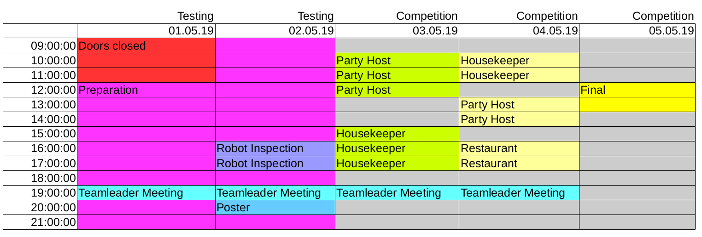
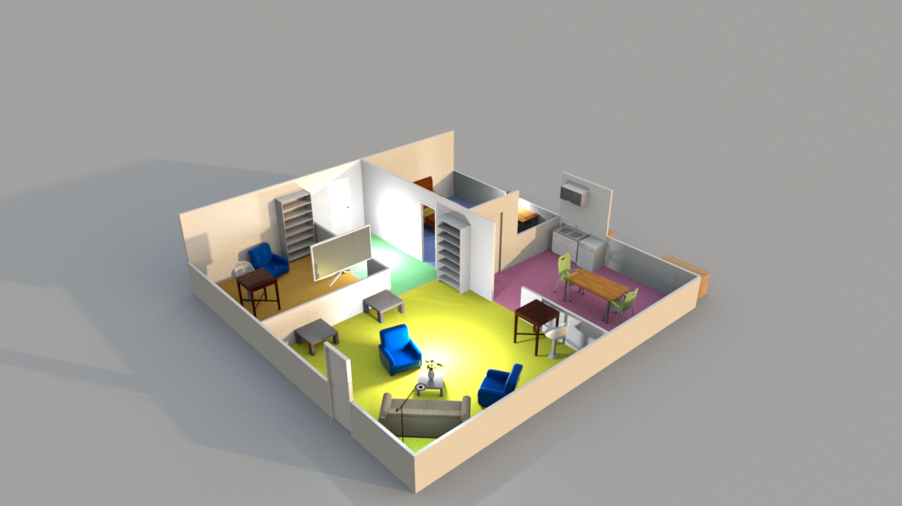
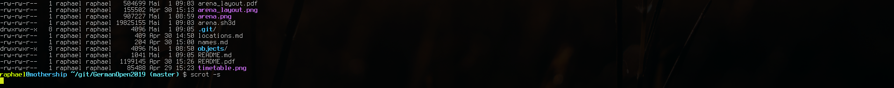

# German Open 2019

Data and definitions for the RoboCup@Home German Open 2019.
If you find issues, we highly appreciate if you report them using the "Issue" system or create "Merge Requests".

Slides as shown on screen are available:

https://userpages.uni-koblenz.de/~raphael/rc_go_2019_orga/rc.pdf

<!--# Scores-->

<!--Scores are preliminary as of now-->

## Timetable

* Note: During the Team-Leader Meeting we will only discuss general topics or tasks for the following day.

## Arena

* [Sweet Home 3d project file](arena.sh3d)
* [Exported .obj file](arena.obj)
* [Exported .pdf file](arena_layout.pdf)

### Locations

* [List of locations and default locations for object classes](locations.md)

Here is an arena overview:

## Names

* [List of names](names.md)

## Objects

* [List of objects](objects/objects.md)

# Task Information

to be published

<!--### Robot Inspection-->

<!---->

## Stage 1

