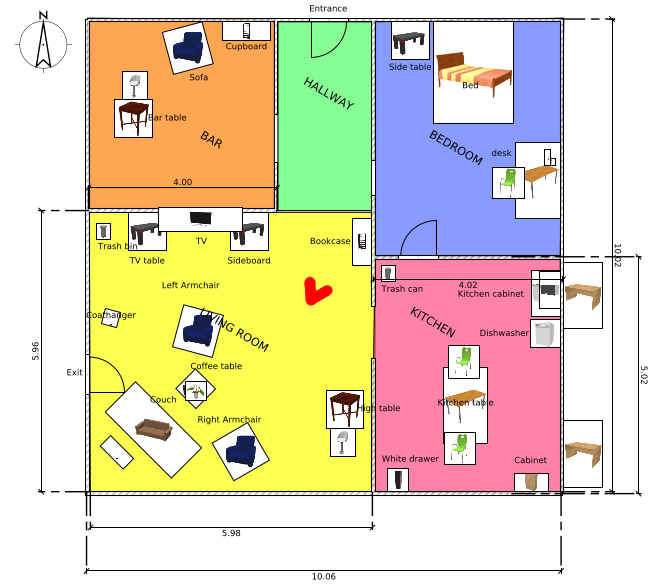

# German Open 2019

Data and definitions for the RoboCup@Home German Open 2019. If you find
issues, we highly appreciate if you report them using the “Issue” system or create
“Merge Requests”.

<!--Slides as shown on screen are available:-->
<!--https://userpages.uni-koblenz.de/~raphael/rc_go_2019_orga/rc.pdf-->

# Timetable

* Note: During the Team-Leader Meeting we will only discuss general topics or tasks for the following day.

## Schedule

|Order | Robot Inspection (Thu 16-18) 
|------|------------------------------
|1     | CATIE                        
|2     | PARICHARYA                   
|3     | SUTURO                       
|4     | b-it-bots                    
|5     | SCC                          
|6     | Golem                        
|7     | Tech United                  
|8     | ToBI                         
|9     | Homer                        

|Order | Stage 1 - Party Host (Fri 10-13) 
|------|--------------------------------
|1     | Tech United
|2     | b-it-bots                   
|3     | CATIE                       
|4     | PARICHARYA                  
|5     | Homer                       
|6     | SUTURO                      
|7     | Golem                       
|8     | ToBI                        
|9     | SCC                         

|Order | Stage 1 - House Keeper (Fri 15-18) 
|------|--------------------------------
|1     | CATIE
|2     | Golem                     
|3     | b-it-bots                 
|4     | SCC                       
|5     | PARICHARYA                
|6     | SUTURO                    
|7     | ToBI                      
|8     | Tech United               
|9     | Homer

## Slots 02.05

### Testing (limited amount of teams)

| Time     | Team 1          | Team 2                 | Team 3
|----------|-----------------|------------------------|--------------------------------------
| 10:00:00 | B-it-bots	     | ToBi	                  | PARICHARYA
| 10:30:00 | CATIE Robotics  | Tech United Eindhoven  | homer@UniKoblenz
| 11:00:00 | Golem	         | SUTURO	              | SCC - Serious Cybernetics Corporation

### Mapping (one team only)

| Time     | Team
|----------|-----------------------------------------
| 13:00:00 | B-it-bots
| 13:10:00 | CATIE Robotics
| 13:20:00 | Golem
| 13:30:00 | homer@UniKoblenz
| 13:40:00 | PARICHARYA
| 13:50:00 | SCC - Serious Cybernetics Corporation
| 14:00:00 | SUTURO
| 14:10:00 | Tech United Eindhoven
| 14:20:00 | ToBi

# Arena

* [Sweet Home 3d project file](arena.sh3d)
<!--* Exported .obj file-->
* [Exported .pdf file](arena_layout.pdf)

Here is an arena overview:

* There is some furniture missing.
* Furniture positions are about to vary slightly during the days 

# Locations

* [List of locations and default locations for object classes](locations.md)

# Names

*  [List of names](names.md)

# Objects

* [List of objects](objects/objects.md)
* [List of objects (.pdf)](objects/objects.pdf)

# Task Information

## Robot Inspection

## Carry My Luggage

## Farewell

## Find My Mates

* Location living room

## GPSR

## Receptionist

## Serving Drink

## Storing Groceries

* test will take place at bookcase 
* objects will be on sideboard
* enter through entrance

## Take out the garbage

